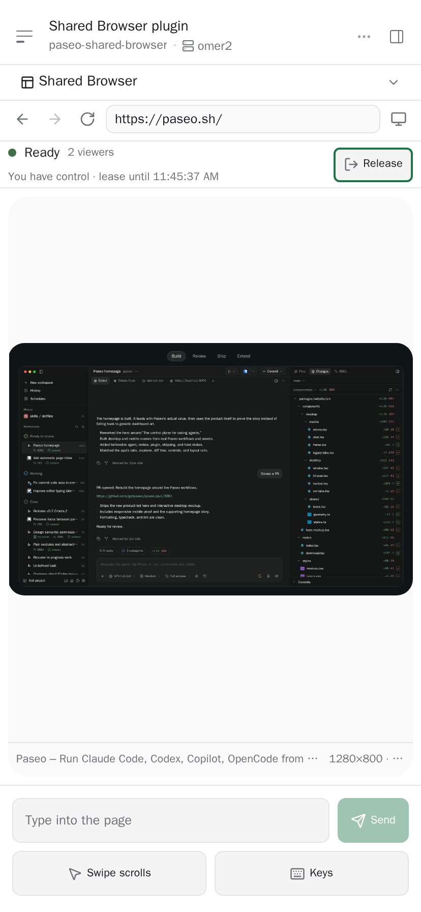

# Shared Browser

> [!IMPORTANT]
> This repository is archived. Development moved to
> [`omercnet/paseo-plugins/paseo-shared-browser`](https://github.com/omercnet/paseo-plugins/tree/main/paseo-shared-browser).
> Existing Paseo Git installations remain on this repository. Migrate with:
>
> ```bash
> paseo plugin remove shared-browser
> paseo plugin add omercnet/paseo-plugins:paseo-shared-browser
> ```

A Paseo plugin that runs one real Chromium browser per workspace on the daemon host and shares that
exact live session with every connected Paseo client.

This is not URL synchronization and not a second browser with copied cookies. Every viewer sees the
same running page, the same DOM, and the same login state. One viewer holds control at a time and
hands it over explicitly.

## Screenshots

### Wide desktop


### Compact client



## What it does

- One persistent Chromium session per workspace, owned by the plugin on the daemon host.
- Every connected client (desktop, web, iOS, Android) views the same page from the same session.
- Server-authoritative control lease: many viewers, one controller, explicit take, release, and
  takeover.
- Frames stream from Chromium's compositor through CDP `Page.startScreencast`, with a bounded
  `page.screenshot()` fallback.
- Remote input: tap, double-tap, right-click, drag, swipe scrolling, text entry, and special keys.
- Device emulation presets (Desktop Chrome, iPhone 15 Pro, Pixel 7, iPad Pro 11) change viewport,
  device pixel ratio, touch behavior, and user agent together, plus a custom canonical viewport.
- A dedicated private browser profile per workspace keeps cookies and site logins across restarts,
  and never touches your personal Chrome, Safari, or Paseo browser profile.
- The browser survives viewers detaching; stopping the plugin closes it.

## Install

Install on the Paseo daemon host with plugins enabled:

```bash
paseo plugin add omercnet/paseo-plugins:paseo-shared-browser
paseo plugin ls
```

Or install from a local monorepo checkout:

```bash
cd paseo-plugins/paseo-shared-browser
npm ci
npm run prepare:runtime
npm exec -- playwright install chromium
paseo plugin install "$PWD"
```

Installation runs the manifest `build` steps: `npm ci`, `npm run prepare:runtime`, and
`playwright install chromium`. The Chromium download is roughly 180 MB and needs network access on
the daemon host.

Open a workspace, search the Command Center for **Open Shared Browser**, or tap the **Shared
Browser** composer pill that appears while a workspace session is open.

## Controls

- Toolbar: back, forward, reload, address bar, device emulation.
- Status row: session state, viewer count, controller, and lease expiry.
- Control: **Take control**, **Release**, and **Take over** for an explicit handoff.
- Mobile: swipe scrolls the page by default; pointer and keyboard options open as bottom sheets.

## Security and scope

- Plugins are trusted, unsandboxed code. Server code runs as the daemon user on the daemon host.
- The launched Chromium keeps its own sandbox enabled; no `--no-sandbox`.
- Control tokens coordinate same-user paired clients. Paseo v0.8 plugin RPC callbacks expose no
  authenticated caller identity, so they are a workflow safeguard, not an authorization boundary.
- Playwright uses pipe transport, so no CDP network port is opened.
- Downloads, uploads, clipboard sync, media permissions, and extensions stay disabled.
- Native passkeys and platform authenticators are unavailable in this headless session.

## Develop

```bash
npm install
npm run typecheck
npm run lint
npm run format:check
npm run test:unit
npm run prepare:runtime
paseo plugin install "$PWD"
paseo plugin reload shared-browser
```

`npm run test:smoke` launches real Chromium and exercises two viewers, control handoff, stale-frame
rejection, viewport changes, device emulation, and profile persistence. It binds its fixture server
to the host's Tailscale IPv4 address, so it runs locally rather than in CI.

Release Please maintains the version, changelog, tags, and GitHub releases from Conventional
Commits. Each release attaches an installable `shared-browser-vX.Y.Z.zip` archive.

Both the Paseo daemon and app must run Paseo 0.8.x (`>=0.8.0 <0.9.0`, including prereleases);
Paseo 0.9 and later are intentionally excluded until compatibility is validated. Typechecking targets
the `0.8.0-beta.1` plugin API with React `19.1`, React Native `0.81`, and Playwright `1.63`.
